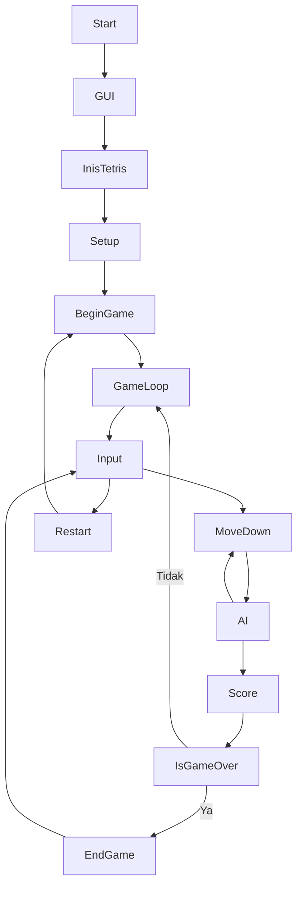

# Proyek Kolaborasi Python AF141

Selamat datang di **Proyek Kolaborasi Python AF141**. Repo ini merupakan hasil kerja sama dan pembelajaran kelompok kami dalam mata kuliah Python.

## Anggota Kolaborasi

- **Muh. Hidayat** ([Syphilum](https://github.com/Syphilum))
- **Indra Satya Nicolaus Pamilangan** ([Yoikss](https://github.com/Yoikss))
- **Jimmy Ponto Wohon** ([jiwopes-pixel](https://github.com/jiwopes-pixel))
- **Ferel Timothy Kimbal** ([ferelkimbal026](https://github.com/ferelkimbal026))

## Deskripsi Proyek

Proyek kolaborasi berupa game **TETRIS**

## Requirements
- [python](https://www.python.org/downloads/release/python-3140/)
- PyQt5
  ```bash
  pip install pyqt5
  ```
- NumPy
  ```bash
  pip install numpy
  ```

## Cara Penggunaan

1. Clone repo:
   ```bash
   git clone https://github.com/Syphilum/Proyek-Kolaborasi-Python-AF141.git
   ```
2. Masuk ke direktori:
   ```bash
   cd Proyek-Kolaborasi-Python-AF141
   ```
3. jalankan permainan
   ```bash
   python tetris_game.py
   ```

## Flowchart


## Kontributor

The gang members:

| Nama Kontributor        | Persentase Kontribusi | Jumlah Kontribusi | Profil GitHub                              | Avatar                                        |
|------------------------|----------------------|-------------------|--------------------------------------------|-----------------------------------------------|
| Hidayat               | 73%                  | 24                | [Syphilum](https://github.com/Syphilum)            |      |
| Indra                 | 12%                  | 4                 | [Yoikss](https://github.com/Yoikss)                |        |
| Ferel         | 6%                   | 2                 | [ferelkimbal026](https://github.com/ferelkimbal026) | |
| Jimmy          | 9%                  | 3                 | [jiwopes-pixel](https://github.com/jiwopes-pixel)  |  |

> Persentase kontribusi otomatis dihitung dari jumlah kontribusi (commits/PR/issue) berdasarkan data halaman [Insights Contributors](https://github.com/Syphilum/Proyek-Kolaborasi-Python-AF141/graphs/contributors).

Terima kasih atas kontribusi semua rekan-rekan!

## Lisensi

Repo ini dibuat khusus untuk keperluan pembelajaran dan tidak dimaksudkan untuk penggunaan komersial.

---

Terima kasih telah mampir! Untuk pertanyaan atau diskusi bisa menghubungi salah satu anggota atau menggunakan fitur _Issues_ pada repository.
